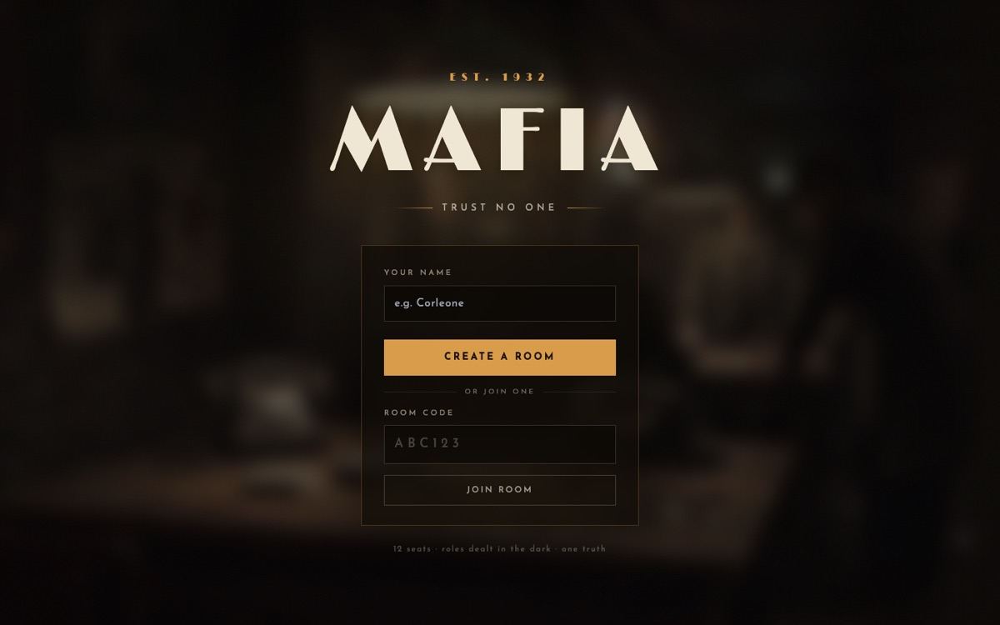
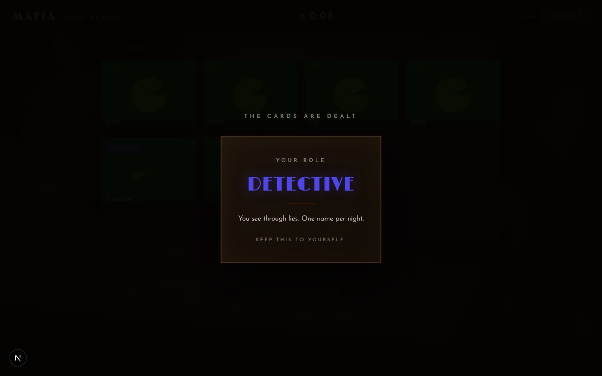
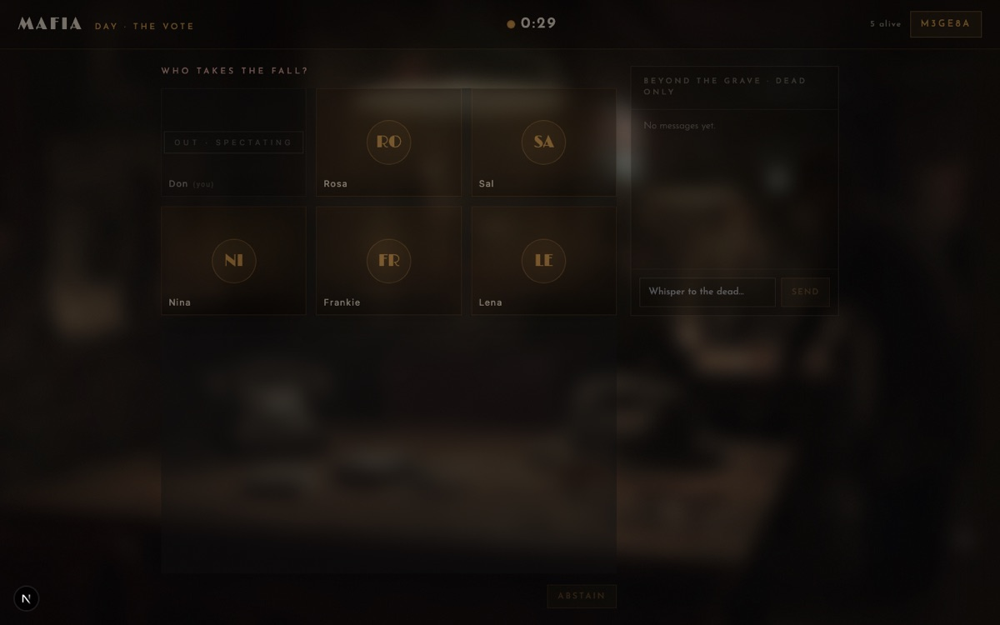

# MAFIA — Est. 1932 🥃

**Play the classic party game [Mafia](https://en.wikipedia.org/wiki/Mafia_(party_game)) over live video — no human narrator needed. The app runs the whole game.**

**▶ Play now: [mafia-game-web-6dn4.vercel.app](https://mafia-game-web-6dn4.vercel.app)** — create a room, send the 6-letter code to 5–11 friends, and deal the cards.



## What is this?

Mafia is the social deduction game you've probably played at camp or a party: a few secret Mafia try to eliminate the town, the town tries to vote out the Mafia, and everyone lies constantly. Normally one person has to sit out as the "narrator" who runs the night phases and tracks who's dead.

**This app *is* the narrator.** Everyone plays. It deals secret roles, runs the day/night phases on a timer, collects the Mafia's kill, the Doctor's save, and the Detective's investigation in secret, tallies the day vote, announces deaths, and calls the winner — all over built-in **live video and voice**, styled as a 1932 speakeasy.

## How a game plays

Each player gets a secret role, dealt face-down:

| Role | Team | Power |
|---|---|---|
| 🔴 **Mafia** | Mafia | Each night, collectively choose someone to eliminate. They know who their partners are. |
| 🟢 **Doctor** | Town | Each night, protect one person from the Mafia (self allowed). |
| 🔵 **Detective** | Town | Each night, investigate one player and secretly learn if they're Mafia. |
| ⚪ **Civilian** | Town | No powers — just their voice, their read on people, and their vote. |

The game loops **Night → Day** until one side wins:

1. **Night** — the app walks through Mafia kill, Doctor save, and Detective investigation, one at a time. During the Mafia's turn, everyone else is *server-side muted* so the Mafia can whisper openly.
2. **Dawn** — the app announces who died (or that the Doctor saved them).
3. **Day** — open discussion over video, then a vote. Plurality gets eliminated; ties spare everyone.
4. **Win check** — Town wins when every Mafia is gone. Mafia wins when they reach parity with the town.

Dead players stay at the table as muted spectators with a private **"Beyond the Grave"** ghost chat that only the dead can read.

| The deal | The vote |
|---|---|
|  |  |

## Why it's cheat-proof

The server is authoritative — the client is never told anything the player shouldn't know:

- Every player receives a **personalized game state**: Mafia see their partners; everyone else sees nothing until roles are revealed by death or game end.
- Night actions, vote tallies, and win conditions are computed **server-side only**.
- Death mutes your mic and camera **at the media server** (LiveKit), not in the UI — a dead player can't unmute themselves with dev tools.
- During the Mafia's night turn, non-Mafia are server-muted, so there's no audio to eavesdrop on.

Rooms hold **6–12 players** (role balance scales: 1 Mafia at 6 players up to 3 at 10+), survive page refreshes (your seat is held and re-bound on reconnect), and support instant rematch with reshuffled roles. Hosts pick fast / normal / long phase timers.

## Tech stack

- **Frontend:** Next.js 15 (App Router) + React 19 + TypeScript + Tailwind + Framer Motion + Zustand
- **Backend:** Node.js + Socket.IO — authoritative game server running the phase state machine
- **Media:** LiveKit Cloud — video + voice, with server-side mute enforcement
- **Monorepo:** pnpm workspaces — `apps/web`, `apps/server`, `packages/shared`
- **Tests:** vitest (game-logic units) + Playwright (multi-browser e2e that plays real 6-player games with fake cameras)

See [`docs/ARCHITECTURE.md`](docs/ARCHITECTURE.md) for the system design, [`docs/GAME_STATES.md`](docs/GAME_STATES.md) for the phase machine, [`docs/ROLES.md`](docs/ROLES.md) for the role spec, and [`docs/CHANGELOG.md`](docs/CHANGELOG.md) for the full feature log.

## Local development

```bash
pnpm install                 # installs all workspaces
cp apps/server/.env.example apps/server/.env
cp apps/web/.env.example apps/web/.env.local
# fill apps/server/.env with LiveKit creds — see below
pnpm dev                     # runs web (:3000) and server (:4000) in parallel
```

Open http://localhost:3000.

### LiveKit setup

Video and voice run through [LiveKit Cloud](https://cloud.livekit.io) (free tier is plenty). Create a project, then copy the URL, API key, and API secret into `apps/server/.env`:

```env
LIVEKIT_URL=wss://<your-project>.livekit.cloud
LIVEKIT_API_KEY=...
LIVEKIT_API_SECRET=...
```

Without these the game is fully playable — you just get name tiles instead of camera tiles.

## Scripts

```bash
pnpm dev          # web + server in parallel
pnpm typecheck    # all packages
pnpm lint         # all packages
pnpm test         # unit tests (39 vitest specs on the game logic)
pnpm e2e          # Playwright e2e (drives real multi-browser games)
pnpm format       # prettier
```

## Deployment

The two apps deploy separately. Config files (`apps/web/vercel.json`, `railway.json`) pin the build/install/start commands so the platform UIs need almost no manual setup.

- **`apps/web` → Vercel.** Import the repo and set **Root Directory = `apps/web`** in the Vercel project settings (Settings → General → Root Directory). Vercel will then auto-detect Next.js; `apps/web/vercel.json` `cd`s up to the repo root for `pnpm install` so workspace deps resolve. Add env var `NEXT_PUBLIC_SERVER_URL` pointing at your deployed server URL.
- **`apps/server` → Railway** (or Fly.io / Render). Needs persistent WebSocket connections — won't run on Vercel. Import the repo; `railway.json` pins the build + start. Set env vars `LIVEKIT_URL`, `LIVEKIT_API_KEY`, `LIVEKIT_API_SECRET`, and `WEB_ORIGIN` (your Vercel URL). The server runs via `tsx` in production; no compile step.

Also add your Vercel domains to the allowed origins in your LiveKit Cloud project.

## Project layout

```
apps/
  web/        — Next.js client (rooms, lobby, video, chat UI)
  server/     — Node + Socket.IO authoritative game server
packages/
  shared/     — Shared TypeScript types and event contracts
docs/         — Architecture, game states, role spec, ADRs
```

## Contributing

See [`CONTRIBUTING.md`](CONTRIBUTING.md) and [`CLAUDE.md`](CLAUDE.md).
